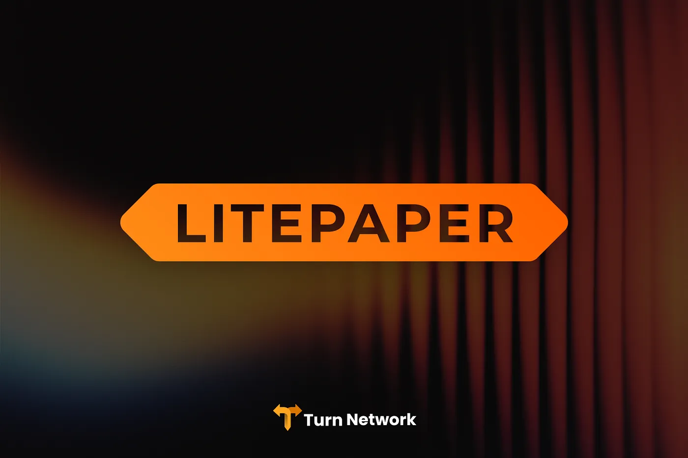
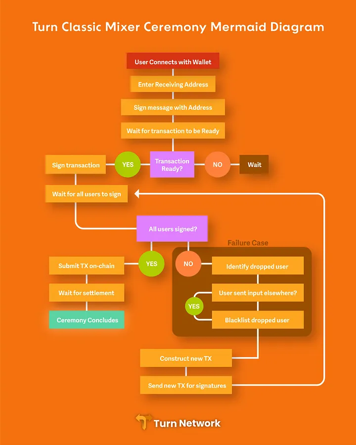

# Litepaper

**We’re excited to release the Turn Network litepaper.** This article will explain the vision of Turn, an open-source mixing protocol on Cardano.

## Overview

1. Abstract
2. Introduction
3. Goals
4. Products
5. Team
6. Roadmap
7. Conclusion

## 1. Abstract 

Cardano has been live on mainnet for over 7 years. We have reliable DEXs, lending protocols, synthetics, stablecoins — mostly everything we need for a robust DeFi ecosystem. There is one area, however, where we are coming up short: privacy.

To this day, we don’t have a reliable mixing protocol for both ADA and Cardano native tokens. Welcome to Turn Network.

Turn is an open-source privacy protocol focused on security and reliability.

Gone are the days of not being able to mix your favorite Cardano tokens when you need to most.

Our protocol is not only focused on mixing ADA and other ecosystem project tokens such as SNEK, WMTx, and IAG — but we also see the larger opportunity with supporting synthetics and stablecoins, such as iBTC, MIDAS, USDM, where Cardano users will now be able to easily mix assets pegged to BTC, USD, GOLD, and other non-ADA tied assets. Working closely with these alternative assets positions Cardano to be a major hub for privacy across the cryptocurrency industry — and even moreso when considering possibilities with interoperability protocol Rosen Bridge, and Cardano partnerchain Midnight.

In this litepaper, we introduce our **three privacy products.**

- Turn Classic
- Stablecoin Mixer
- Shielded Assets

Our products leverage Cardano’s robust technological infrastructure to offer secure, transparent, and efficient privacy solutions that ensure anonymity for both individual users and decentralized applications. Privacy is a key pillar of a thriving DeFi ecosystem, and we believe we are positioned to become the **privacy leaders on Cardano.**

## 2. Introduction 

### Privacy in the Blockchain Ecosystem

Privacy has become a significant concern in the blockchain space. While blockchain technology provides transparency and security, it also exposes transaction details that can be used to trace and analyze users’ financial activities. With growing concerns about user privacy and surveillance, privacy-preserving solutions have gained prominence, especially with the recent favorable ruling of removing sanctions on Tornado Cash. Privacy protocols allow users to obfuscate the origin and destination of their transactions, enhancing confidentiality without sacrificing security or decentralization.

### Solution 

Turn Network offers a mixing protocol specifically designed for the Cardano blockchain, enabling the mixing of ADA, Cardano-native assets, and cross-chain synthetic assets. Turn Network uses a simple and secure approach to ensure that transactions are shielded from public. By mixing assets, users can enhance their privacy and ensure that their transactions cannot be traced back to them, allowing for greater anonymity when interacting with both Cardano-native and cross-chain assets.

## 3. Goals

Turn Network has three main goals:

1. **Enhance User Privacy for ADA and CNTs:** Provide a secure and decentralized method for users to mix their assets, ensuring their privacy without compromising security or transparency.

2. **Stablecoin Privacy:** Enable the mixing of synthetic/stablecoin tokens like USDM, iBTC and MIDAS — tokens that are not directly correlated with ADA and other project governance tokens.
3. **Grow Cardano Through Privacy Solutions:** Leverage existing Cardano tools (such as Rosen Bridge) so tokens outside the ecosystem can easily mix on Cardano, making Cardano a privacy hub for the entire cryptocurrency industry.

## 4. Products
Turn Network will be open-source and available for public use with full transparency and security. Public testnet is set to release this month, which will allow users to mix ADA and other Cardano native tokens.

We anticipate 3 main privacy products:

1. **Turn Classic Mixer**
2. **Stablecoin Mixer**
3. **Shielded Assets**

### Turn Classic Mixer

Turn Classic is a mixing protocol based on CoinJoin. A centralized operator collects messages off-chain from users which signal their intention to participate in a mixing event. The operator builds a transaction with inputs from all of the participants and collects signatures from them. If a participant fails to sign, a new transaction is constructed and signatures are collected again. It’s important that all the outputs of this transaction are uniform, meaning every participant must mix the same amount of ada. This transaction also includes a fee which, after operational expenses are paid, is locked in a smart contract to be distributed later. Below is a diagram of our Turn Classic will work.

### Stablecoin Mixer

The design of the classic mixer presents a certain limitation. For every configuration of the mixers variables (output size, token type) a new set of users is required. That is to say the responsiveness of the mixer is directly proportional to the number of currently active users. As more users participate the frequency of mixing events goes up. For example, if you had five participants per day you may only be able to mix funds once per day. But if you had 500 participants per day it may make sense to mix once every fifteen minutes.

If we treat all USD pegged stablecoins as fungible we allow ourselves to pull more users together and thus operate the mixer with a greater frequency. This is exactly how the stablecoin mixer will work. Users will enter whatever stablecoins they have into the mixer and will receive a *mixture of the various stablecoins* provided by each user. Of course this will require a whitelist of **approved stablecoins that meet sufficient liquidity standards**; which is to be decided by our community.

The exact same approach can be taken with other assets with multiple on-chain representations. For example, iBTC and rsBTC could be treated as fully fungible — again, assuming all tokens maintain sufficient liquidity standards.

### Shielded Assets

Shielded assets represent value without publicly disclosing what value they represent. Only using a special decryption key can the value of these assets be read — this feature will be available via Midnight. A single shielded asset can represent a bundle of many different coins. This will work by bridging assets from various networks to Midnight where they will be locked. Midnight will issue an NFT which must be burnt in order to withdraw the original assets. This NFT is the shielded asset and it can be easily bridged back to Cardano, or any other network with a connection to Midnight.

More details on our shielded assets product will be released after completion of Turn Classic and our Stablecoin Mixer.

For now you can think of shielded assets as bundles of tokens dipped into Midnight, gaining a coating of privacy protection that can only be revealed with a decryption key.

## 5. Founder

Turn Network is founded by [William Doyle](https://x.com/william00000010), a Cardano dRep and longtime blockchain developer. William has years of expertise in blockchain development, specifically in quantum security, and is striving to advance privacy solutions on Cardano. A catalog of his previous work can be found [here](https://projects.williamdoyle.ca/).

## 6. Roadmap

Below is our roadmap for 2025 and beyond as we look to launch our 3 privacy products.

### Q1 2025

- Turn Classic Public Testnet; should be ready in about two weeks.
- Turn Classic Audit

### Q2 2025

- Mainnet V1 Launch — Launch Turn Network V1 on the Cardano mainnet with full support for ADA and Cardano native tokens.
- Stablecoin Mixer Public Testnet
- Stablecoin Mixer Audit
- Stablecoin Mixer Mainnet

### Q4 2025

- Shielded Assets Public Testnet (Midnight)
- Shielded Assets Audit

### Q1 2026

- Shielded Assets Mainnet

## 7. Conclusion

We’re striving to provide a crucial privacy solution to the Cardano ecosystem, enabling users to confidently mix ADA, native tokens, and stablecoins in a secure and reliable environment. All of our code will be open sourced shortly for the community to review and we expect our public testnet to be live in 2 weeks.

We look forward to your participation and welcome feedback from our community as we build towards a more private and secure ecosystem on Cardano.
